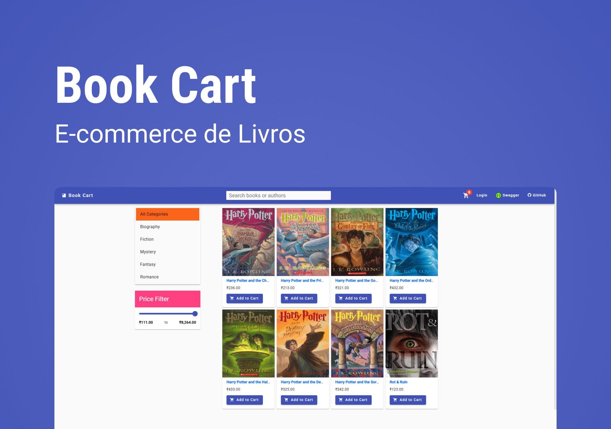

# BookCart Automation


<p align="center">
  
</p>

Este repositório contém o projeto de automação de testes end-to-end para a aplicação [BookCart](https://bookcart.azurewebsites.net/), utilizando **Cypress** como ferramenta principal de automação.

## 📚 Sobre o Projeto

O objetivo deste projeto é automatizar os principais fluxos do e-commerce BookCart, garantindo a qualidade das funcionalidades essenciais da aplicação, como login, cadastro de usuário, adição de livros ao carrinho e sistema de favoritos.

## 🛠 Tecnologias Utilizadas

- [Cypress](https://www.cypress.io/) - Framework de automação de testes
- JavaScript
- Page Object Model (POM) - Padrão de organização de código para testes

## 📄 Estrutura do Projeto

```bash
bookcart-automation/
├── cypress/
│   ├── e2e/
│   │   ├── pages/
│   │   ├── tests/
│   ├── fixtures/
│   ├── support/
│   └── ...
├── cypress.config.js
└── package.json
```

- **pages/**: Arquivos de Page Objects (elementos e ações de cada página)
- **tests/**: Arquivos de testes automatizados
- **fixtures/**: Dados simulados (mock) para os testes
- **support/**: Configurações e comandos customizados do Cypress

## 🚀 Como Executar

1. Clone o repositório:

```bash
git clone https://github.com/Ali-Maia/bookcart-automation.git
```

2. Instale as dependências:

```bash
npm install
```

3. Execute os testes:

- Para abrir o Cypress no modo interativo:

```bash
npx cypress open
```

- Para rodar os testes em modo headless:

```bash
npx cypress run
```

## 📌 Funcionalidades Testadas

- Cadastro de novo usuário
- Login de usuário
- Adicionar livros ao carrinho
- Fluxo completo de compra

## 🌪️ Exemplo de Teste

```javascript
describe('Login Test', () => {
  it('Deve fazer login com sucesso', () => {
    cy.visit('/login');
    cy.get('input[name="email"]').type('usuario@teste.com');
    cy.get('input[name="password"]').type('senhaSegura123');
    cy.get('button[type="submit"]').click();
    cy.contains('Bem-vindo').should('be.visible');
  });
});
```

## ✨ Contribuições

Sinta-se à vontade para abrir issues e pull requests para sugerir melhorias, novos testes ou correções!
